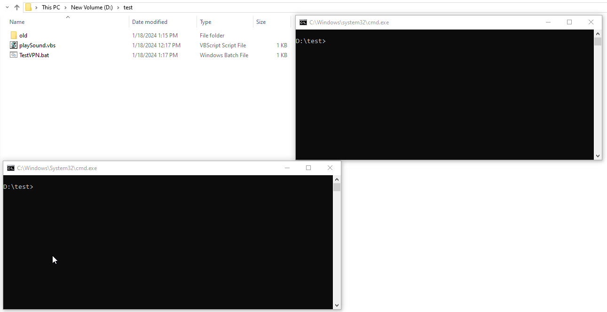

# Test-VPN
A windows batch file to test the port connectivity for every 60 seconds. Useful when we run Burp scans and the host is connected via VPN. When VPN is down, the port is not reachable and you get audio "VPN Disconnected". 

## Script to modify
Update the below for your server IP & Port number
```
set IP_ADDRESS=127.0.0.1
set PORT=9000
```

Update the below for the interval (in seconds). Script is configured to loop every 60 seconds
```
timeout /t 60 >nul
```

Customize the sound
```
cscript //nologo "playSound.vbs" "Customize the sound here"
```

## Demo
<kbd></kbd>
